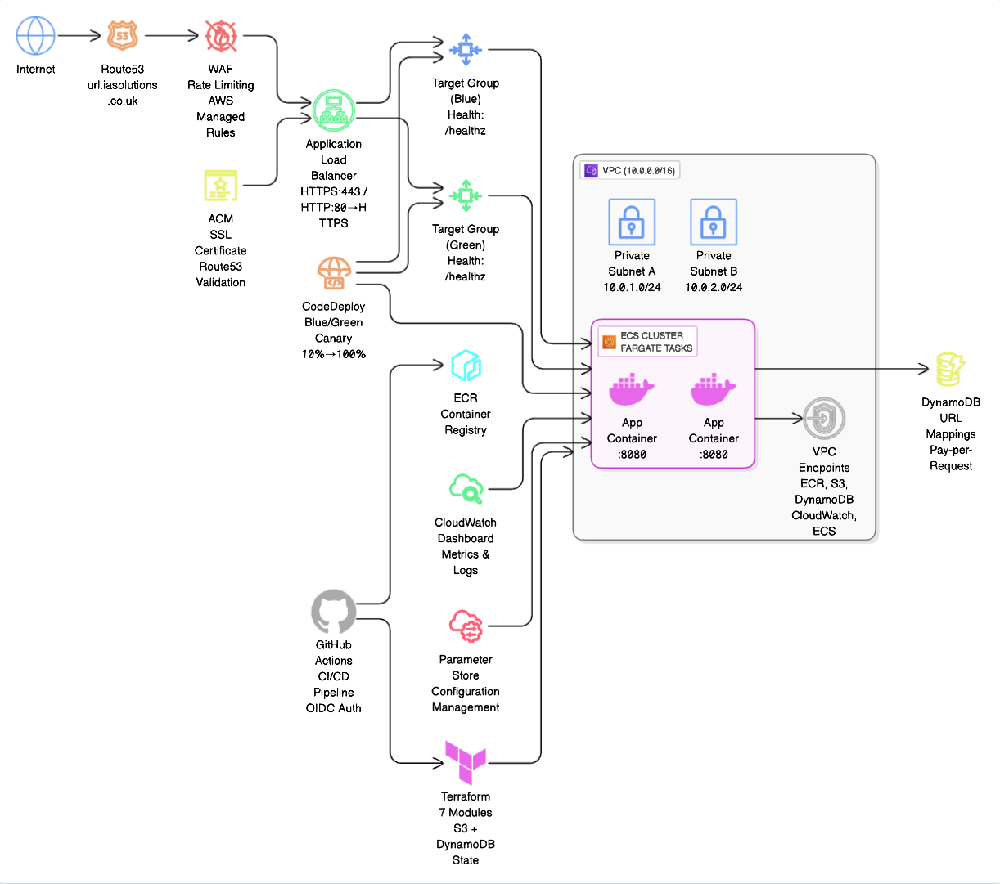

# URL Shortener on AWS ECS

A URL shortening service built to demonstrate production-grade AWS infrastructure using ECS Fargate, Terraform, and automated CI/CD pipelines. This project showcases modern cloud-native architecture patterns and Infrastructure as Code best practices.

**Live Demo:** https://url.iasolutions.co.uk/

## Author

**Alamin Islam**  
💼 LinkedIn: [linkedin.com/in/alamin-islam-58a635300](https://www.linkedin.com/in/alamin-islam-58a635300)  
🌐 Portfolio: [github.com/Aislam00](https://github.com/Aislam00)

## Project Overview

This URL shortener solves the common problem of unwieldy long URLs by providing a clean, scalable service that creates memorable short links. Built primarily as a learning exercise to master AWS ECS, Terraform modules, and production deployment patterns.

**Key Features:**
- Custom domain with HTTPS (url.iasolutions.co.uk)
- Scalable serverless container architecture
- Blue/green deployment capabilities
- Enterprise-grade security with WAF
- Cost-optimized networking (VPC endpoints vs NAT gateways)
- Complete Infrastructure as Code

## Demo

https://github.com/user-attachments/assets/c5c3f7fd-37e8-495b-910a-20d04cb7d82d

The service accepts any valid URL and returns a shortened version. Click the short link to redirect to the original destination.

## Architecture



**Core Components:**
- **ECS Fargate**: Serverless container orchestration
- **Application Load Balancer**: HTTPS termination and traffic distribution  
- **DynamoDB**: NoSQL storage for URL mappings
- **Route53 + ACM**: Custom domain with auto-renewing SSL certificates
- **AWS WAF**: Web application firewall protection
- **VPC Endpoints**: Private AWS service connectivity

## Installation & Setup

### Prerequisites
- AWS CLI configured with appropriate permissions
- Terraform >= 1.0
- Docker
- Python 3.11+

### Clone and Deploy

```bash
# Clone the repository
git clone https://github.com/Aislam00/ecs-url-shortener.git
cd ecs-url-shortener

# Set up Terraform backend (one-time setup)
cd terraform/global/backend
terraform init && terraform apply

# Deploy infrastructure
cd ../../envs/dev
terraform init && terraform apply

# Build and push application
cd ../../../app
docker build --platform linux/amd64 -t url-shortener .

# Tag and push to ECR
aws ecr get-login-password --region eu-west-2 | docker login --username AWS --password-stdin YOUR_ACCOUNT.dkr.ecr.eu-west-2.amazonaws.com
docker tag url-shortener:latest YOUR_ACCOUNT.dkr.ecr.eu-west-2.amazonaws.com/ecs-url-shortener-dev:latest
docker push YOUR_ACCOUNT.dkr.ecr.eu-west-2.amazonaws.com/ecs-url-shortener-dev:latest
```

### Repository Structure


## Usage

### API Endpoints

**Create Short URL:**
```bash
curl -X POST https://url.iasolutions.co.uk/shorten \
  -H "Content-Type: application/json" \
  -d '{"url":"https://github.com/Aislam00"}'

# Response: {"short_url": "https://url.iasolutions.co.uk/abc123"}
```

**Health Check:**
```bash
curl https://url.iasolutions.co.uk/healthz
# Response: {"status":"ok"}
```

**Redirect (Browser):**
```
https://url.iasolutions.co.uk/abc123 → redirects to original URL
```

### Web Interface
Visit https://url.iasolutions.co.uk/ for the web interface - simply paste a URL and click "Shorten It!"

## Infrastructure Details

### Security Implementation

https://github.com/user-attachments/assets/6389f46a-ac8c-4002-8f82-61596a04ba13

**Security Features:**
- WAF with AWS managed rules + custom rate limiting (2000 req/IP)
- All containers in private subnets
- HTTPS enforcement with HTTP→HTTPS redirects
- IAM roles with least privilege access
- VPC endpoints for secure AWS service communication

### CI/CD Pipeline


**Automated Workflow:**
1. Code push triggers GitHub Actions
2. Multi-architecture Docker build (x86/ARM)
3. Push to Amazon ECR
4. ECS service deployment
5. Health check validation

### Monitoring


**Observability:**
- CloudWatch dashboards for ECS and ALB metrics
- Container health checks and target group monitoring
- Parameter Store for configuration management
- Comprehensive logging to CloudWatch Logs

## Running Tests

```bash
# Application tests
cd app
python -m pytest tests/

# Infrastructure validation
cd terraform/envs/dev
terraform plan -detailed-exitcode
terraform validate

# Health check test
curl -f https://url.iasolutions.co.uk/healthz || exit 1
```

## Known Issues

**CloudWatch Metrics:** Dashboard appears sparse due to low traffic volume. Metrics become more meaningful with higher request rates.

**CodeDeploy Complexity:** Blue/green deployments work but require proper S3 deployment packages. AWS documentation on AppSpec file structure could be clearer.

**Cost Monitoring:** Currently no automated cost alerts. Recommend setting up billing alarms for production use.

## Contributing

This project welcomes contributions! Here's how to get started:

1. **Fork the repository**
2. **Create a feature branch:** `git checkout -b feature/amazing-feature`
3. **Make your changes** and test thoroughly
4. **Commit changes:** `git commit -m 'Add amazing feature'`
5. **Push to branch:** `git push origin feature/amazing-feature`
6. **Open a Pull Request**

### Development Guidelines
- Follow Infrastructure as Code principles
- Include tests for new features
- Update documentation for any API changes
- Ensure Terraform code follows best practices
- Test in a separate AWS account/environment

## Possible Next Implementations

- API Gateway for request throttling and API keys
- CloudFront CDN for better global performance
- Analytics dashboard to track link usage
- Custom domain aliases for branded links
- Bulk URL shortening endpoint

## License

This project is licensed under the MIT License - see the [LICENSE](LICENSE) file for details.

---

**Tech Stack:** AWS ECS Fargate, Terraform, Python Flask, GitHub Actions, DynamoDB  
**Live Service:** https://url.iasolutions.co.uk/  
**Portfolio:** [github.com/Aislam00](https://github.com/Aislam00)