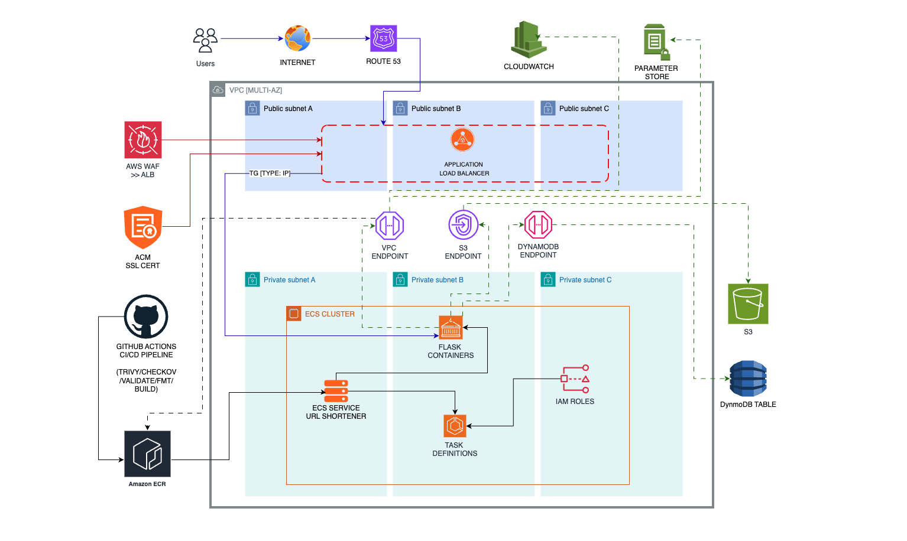
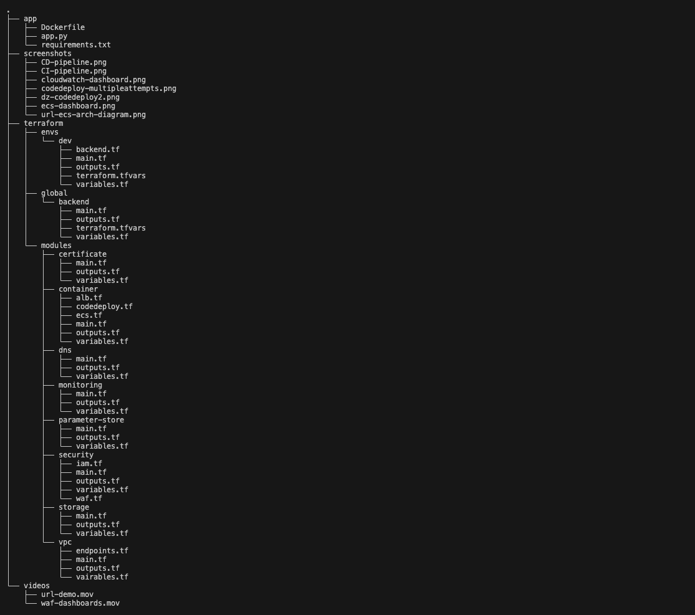
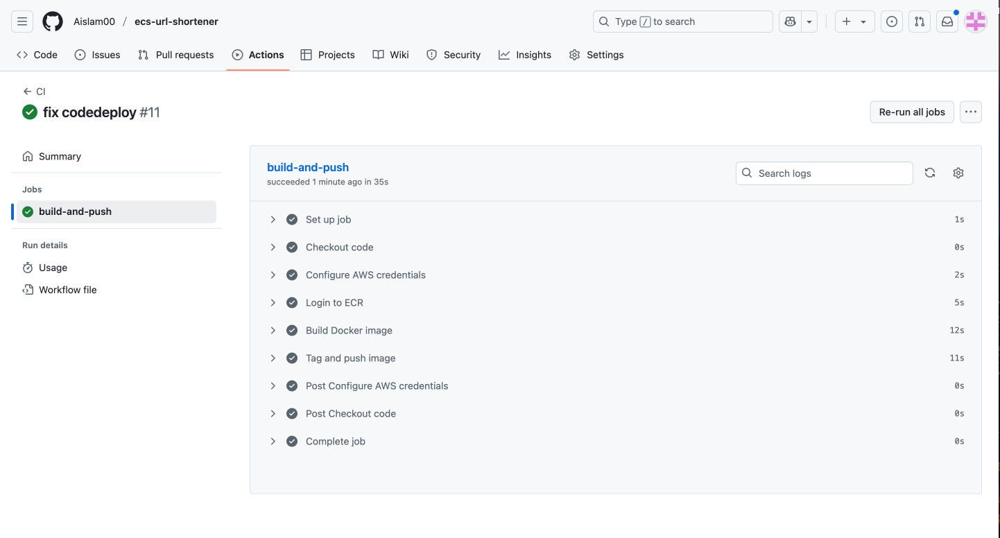
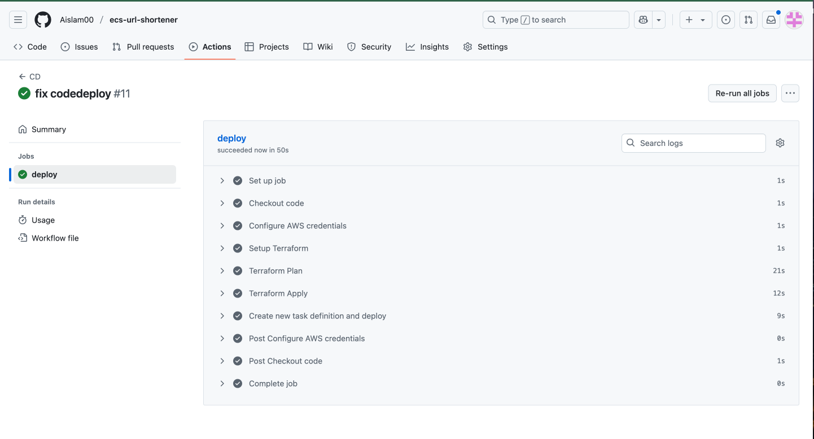
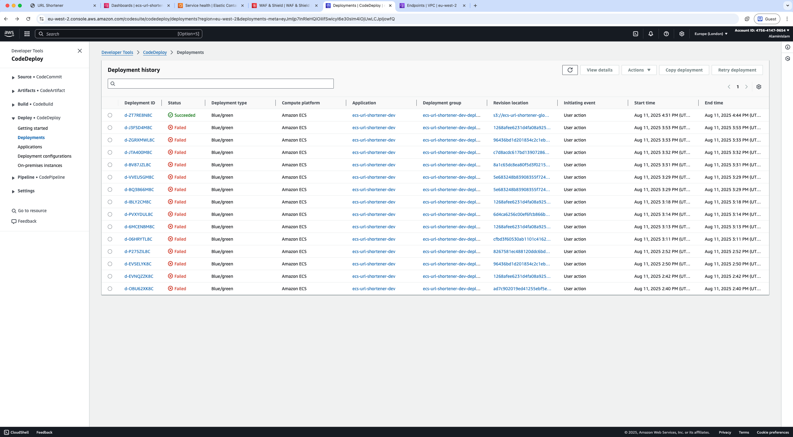
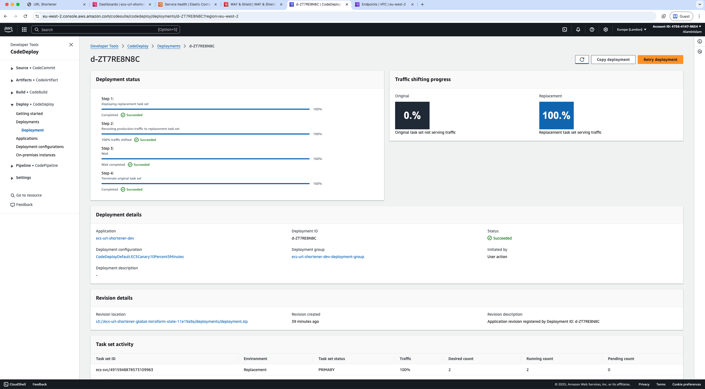
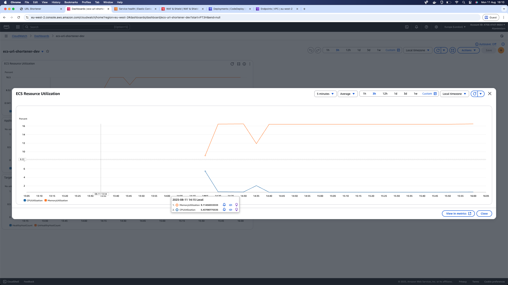
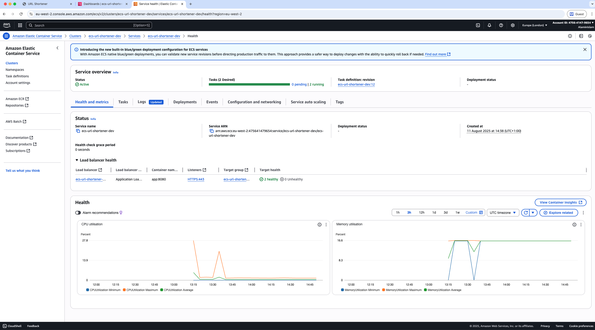

# URL Shortener on AWS ECS

**Tech Stack:** AWS ECS Fargate, Terraform, Python Flask, GitHub Actions, DynamoDB

A URL shortening service built to demonstrate production-grade AWS infrastructure using ECS Fargate, Terraform, and automated CI/CD pipelines. This project showcases modern cloud-native architecture patterns and Infrastructure as Code best practices.

**Live Demo:** https://url.iasolutions.co.uk/

## Author

**Alamin Islam**  
💼 LinkedIn: [linkedin.com/in/alamin-islam-58a635300](https://www.linkedin.com/in/alamin-islam-58a635300)  
🌐 Portfolio: [github.com/Aislam00](https://github.com/Aislam00)

## What it does

This URL shortener solves the common problem of unwieldy long URLs by providing a clean, scalable service that creates memorable short links. Built primarily as a learning exercise to master AWS ECS, Terraform modules, and production deployment patterns.

**Key Features:**
- Custom domain with HTTPS (url.iasolutions.co.uk)
- Scalable serverless container architecture
- Blue/green deployment capabilities
- Enterprise-grade security with WAF
- Cost-optimized networking (VPC endpoints vs NAT gateways)
- Complete Infrastructure as Code

## Live Demo

https://github.com/user-attachments/assets/b0a4b691-5fe4-49f6-a59f-f93c3e3aaca1

The service accepts any valid URL and returns a shortened version. Click the short link to redirect to the original destination.

## How to deploy

### Prerequisites
- AWS CLI configured with appropriate permissions
- Terraform >= 1.0
- Docker
- Python 3.11+

### Clone and Deploy

```bash
# Clone the repository
git clone https://github.com/Aislam00/ecs-url-shortener.git
cd ecs-url-shortener

# Set up Terraform backend (one-time setup)
cd terraform/global/backend
terraform init && terraform apply

# Deploy infrastructure
cd ../../envs/dev
terraform init && terraform apply

# Build and push application
cd ../../../app
docker build --platform linux/amd64 -t url-shortener .

# Tag and push to ECR
aws ecr get-login-password --region eu-west-2 | docker login --username AWS --password-stdin YOUR_ACCOUNT.dkr.ecr.eu-west-2.amazonaws.com
docker tag url-shortener:latest YOUR_ACCOUNT.dkr.ecr.eu-west-2.amazonaws.com/ecs-url-shortener-dev:latest
docker push YOUR_ACCOUNT.dkr.ecr.eu-west-2.amazonaws.com/ecs-url-shortener-dev:latest
```

### Health Check

```bash
curl https://url.iasolutions.co.uk/healthz
# Response: {"status":"ok"}
```

## Architecture



**Core Components:**
- **ECS Fargate** - Serverless container orchestration
- **Application Load Balancer** - HTTPS termination and traffic distribution  
- **DynamoDB** - NoSQL storage for URL mappings
- **Route53 + ACM** - Custom domain with auto-renewing SSL certificates
- **AWS WAF** - Web application firewall protection
- **VPC Endpoints** - Private AWS service connectivity

## Project Structure



Terraform modules organized for reusability and environment separation.

## Security Features

**Security Implementation:**
- WAF with AWS managed rules + custom rate limiting (2000 req/IP)
- All containers in private subnets
- HTTPS enforcement with HTTP→HTTPS redirects
- IAM roles with least privilege access
- VPC endpoints for secure AWS service communication

https://github.com/user-attachments/assets/6389f46a-ac8c-4002-8f82-61596a04ba13

## CI/CD Pipeline

**Automated Workflow:**
1. Code push triggers GitHub Actions
2. Multi-architecture Docker build (x86/ARM)
3. Push to Amazon ECR
4. ECS service deployment
5. Health check validation

### Continuous Integration


### Continuous Deployment


### CodeDeploy Deployment


*Multiple failed attempts due to S3 path configuration - resolved by fixing deployment artifact paths*



## Monitoring & Operations

**Observability:**
- CloudWatch dashboards for ECS and ALB metrics
- Container health checks and target group monitoring
- Parameter Store for configuration management
- Comprehensive logging to CloudWatch Logs

### CloudWatch Dashboard


### ECS Health


## Project Overview

This is a full end-to-end project demonstrating enterprise-grade AWS infrastructure patterns including containerized microservices, Infrastructure as Code, automated CI/CD pipelines, security best practices, and production monitoring. The platform showcases real-world ECS operations with scalable, cost-optimized architecture.